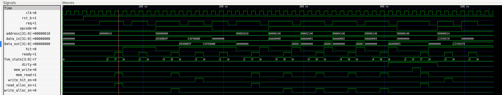
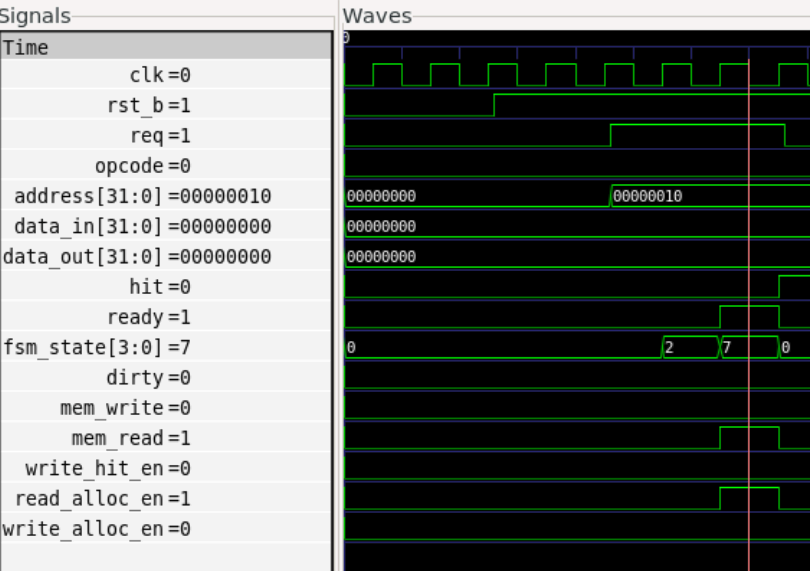
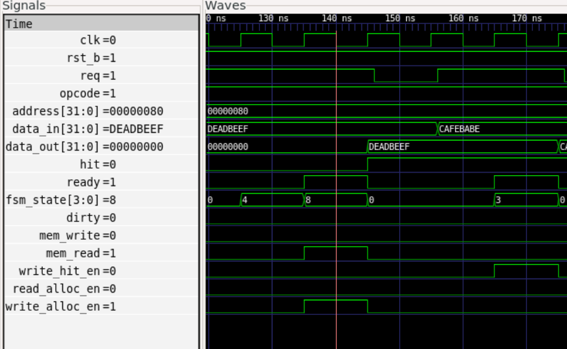
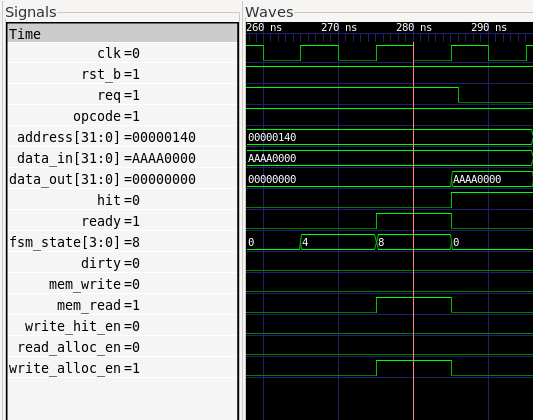

# Cache Controller - Documentatie Tehnica

## 1. Descriere

Cache controller structural in Verilog: arhitectura 4-way set-associative, 128 seturi, LRU replacement, write-back cu write-allocate, pe un bus de date de 32 de biti.

## 2. Specificatii

| Parametru | Valoare |
|---|---|
| Tip | 4-way set-associative |
| Dimensiune totala | 32 KB |
| Dimensiune bloc | 64 octeti |
| Dimensiune cuvant | 4 octeti (32 biti) |
| Numar de seturi | 128 |
| Politica de inlocuire | LRU cu age counters |
| Politica de scriere | Write-back cu write-allocate |

Adresa de 32 de biti este impartita in: tag [31:13] (19 biti), index [12:6] (7 biti), offset [5:0] (6 biti).

## 3. Diagrama bloc functionala

Diagrama bloc functionala este disponibila in fisierul `cache_controller_block_diagram.pdf`.

Sistemul este format din doua blocuri principale conectate la nivelul top-level:

- **FSM** (`cache_fsm`) - primeste `hit` si `dirty` de la cache array si genereaza semnalele de control (`try_read`, `try_write`, `write_hit_en`, `read_alloc_en`, `write_alloc_en`, `mem_read`, `mem_write`, `ready`)
- **Cache array** (`cache_array`) - primeste `address`, `write_data` si semnalele de control de la FSM; returneaza `data_out`, `hit` si `dirty` al LRU victim

In interiorul `cache_array` se afla 128 de instante `cache_set`, fiecare cu 4 ways (`cache_line`) si un LRU tracker (`lru_unit`).

## 4. Masina de stare (FSM)

### 4.1 Diagrama starilor

```
IDLE -- op_read  &  hit  --> READ_HIT  ------------------------------------------> IDLE
IDLE -- op_write &  hit  --> WRITE_HIT ------------------------------------------> IDLE
IDLE -- op_read  & !hit  --> READ_MISS  -- clean --> ALLOC_RD ----------------> IDLE
                                          \- dirty --> EVICT_RD --> ALLOC_RD ---> IDLE
IDLE -- op_write & !hit  --> WRITE_MISS -- clean --> ALLOC_WR ----------------> IDLE
                                           \- dirty --> EVICT_WR --> ALLOC_WR --> IDLE
```

### 4.2 Tranzitii

| Stare curenta | Conditie     | Stare urmatoare |
|---|---|---|
| IDLE          | `op_read & hit`  | READ_HIT  |
| IDLE          | `op_read & !hit` | READ_MISS |
| IDLE          | `op_write & hit` | WRITE_HIT |
| IDLE          | `op_write & !hit`| WRITE_MISS|
| IDLE          | nicio cerere     | IDLE      |
| READ_MISS     | `dirty`          | EVICT_RD  |
| READ_MISS     | `!dirty`         | ALLOC_RD  |
| WRITE_MISS    | `dirty`          | EVICT_WR  |
| WRITE_MISS    | `!dirty`         | ALLOC_WR  |
| EVICT_RD      | -                | ALLOC_RD  |
| EVICT_WR      | -                | ALLOC_WR  |
| READ_HIT, WRITE_HIT, ALLOC_RD, ALLOC_WR | - | IDLE |

### 4.3 Iesiri (Moore)

| Stare      | `try_r` | `try_w` | `mem_w` | `mem_r` | `wh_en` | `ra_en` | `wa_en` | `ready` |
|---|---:|---:|---:|---:|---:|---:|---:|---:|
| IDLE       | op_r | op_w | 0 | 0 | 0 | 0 | 0 | 0 |
| READ_HIT   | 0 | 0 | 0 | 0 | 0 | 0 | 0 | 1 |
| READ_MISS  | 0 | 0 | 0 | 0 | 0 | 0 | 0 | 0 |
| WRITE_HIT  | 0 | 0 | 0 | 0 | 1 | 0 | 0 | 1 |
| WRITE_MISS | 0 | 0 | 0 | 0 | 0 | 0 | 0 | 0 |
| EVICT_RD   | 0 | 0 | 1 | 0 | 0 | 0 | 0 | 0 |
| EVICT_WR   | 0 | 0 | 1 | 0 | 0 | 0 | 0 | 0 |
| ALLOC_RD   | 0 | 0 | 0 | 1 | 0 | 1 | 0 | 1 |
| ALLOC_WR   | 0 | 0 | 0 | 1 | 0 | 0 | 1 | 1 |

Abrevieri coloane: `try_r` = try_read, `try_w` = try_write, `mem_w` = mem_write, `mem_r` = mem_read, `wh_en` = write_hit_en, `ra_en` = read_alloc_en, `wa_en` = write_alloc_en.

## 5. Interfata externa

Modul: `cache_controller.v`

| Semnal | Dir | Latime | Descriere |
|---|---|---:|---|
| `clk`       | in  |  1 | Ceas, esantionat pe front crescator |
| `rst_b`     | in  |  1 | Reset asincron activ pe nivel scazut |
| `req`       | in  |  1 | Cerere activa de la CPU |
| `opcode`    | in  |  1 | 0 = read, 1 = write |
| `data_in`   | in  | 32 | Write data |
| `address`   | in  | 32 | Adresa |
| `data_out`  | out | 32 | Read data din cache |
| `fsm_state` | out |  4 | Starea curenta a FSM-ului |
| `hit`       | out |  1 | Ridicat cand adresa se gaseste in cache |
| `ready`     | out |  1 | Ridicat cand operatia este finalizata |

## 6. Module

### cache_line

Un singur cache line cu tag (19 biti), 16 words de 32 de biti, valid si dirty. Hit-ul este combinational: `tag_match & valid`. Bitul dirty este setat la write-hit sau write-allocate si sters la read-allocate.

### lru_unit

Tracker LRU cu 4 age counters pe 2 biti (0 = LRU, 3 = MRU). La accesul way-ului W: `age[W]` devine 3 si toate way-urile cu age mai mare sunt decrementate. Victim este way-ul cu `age == 0`.

### cache_set

Contine 4 instante `cache_line` si o instanta `lru_unit`. Foloseste `encoder_4to2` pentru detectarea way-ului cu hit si `lru_way` pentru selectia victim la alocare. Semnalele de write si alloc sunt mascate per way.

### cache_array

128 instante `cache_set` generate cu `generate`. Semnalele active sunt mascate cu `active = (index == i)`.

### Primitive

- `comparator` - comparator parametrizabil pe N biti, folosit pentru tag matching
- `encoder_4to2` - encoder cu prioritate 4:2 cu semnal valid, folosit pentru detectarea way-ului cu hit

## 7. Latente

Clock cycle: 10 ns. Latentele sunt masurate de la ciclul in care `req` este ridicat.

| Operatie | Cicluri |
|---|---:|
| Hit (read/write)           | 2 |
| Miss fara evacuare         | 3 |
| Miss cu evacuare (dirty)   | 4 |

## 8. Testbench si rezultate

Fisier: `sim/cache_controller_tb.v`. Acopera 8 teste care exercita toate cele 9 stari FSM. Genereaza `cache_sim.vcd` pentru GTKWave.

Teste incluse:

| Test | Operatie | Comportament asteptat |
|---|---|---|
| 1 | Citire la adresa noua | READ_MISS -> ALLOC_RD |
| 2 | Citire repetata | READ_HIT |
| 3 | Scriere la adresa noua | WRITE_MISS -> ALLOC_WR, dirty=1 |
| 4 | Scriere la adresa existenta | WRITE_HIT |
| 5 | Citire dupa scriere | READ_HIT, data corecta |
| 6 | Citire in alt set | READ_MISS -> ALLOC_RD |
| 7 | Umplere set + evacuare | WRITE_MISS x4, apoi READ_MISS -> EVICT_RD -> ALLOC_RD |
| 8 | Acces la word diferit in acelasi bloc | WRITE_HIT, READ_HIT |

Rulare: `bash run.sh` sau `bash run.sh --view` pentru GTKWave.

### 8.1 Forme de unda (GTKWave)

**Figura 1 - Vedere de ansamblu (toate cele 8 teste, T=0-536 ns)**



Imaginea prezinta intreaga simulare. Secventa de stari FSM vizibila pe `fsm_state` este: `2,7 -> 1 -> 4,8 -> 3 -> 1 -> 2,7 -> 4,8 -> 4,8 -> 4,8 -> 4,8 -> 2,5,7 -> 3 -> 1`, corespunzand celor 8 teste. Adresele accesate (`00000010`, `00000080`, `00002010`, `00000140`-`00008140`, `00000014`) si datele scrise (`DEADBEEF`, `CAFEBABE`, `AAAA0000`-`AAAA0003`, `12345678`) sunt vizibile pe liniile `address` si `data_in`. In jurul T=430 ns se observa secventa `2,5,7` - singurul ciclu de evacuare (EVICT_RD) din simulare, declansat de citirea in setul complet si murdar.

---

**Figura 2 - READ_MISS -> ALLOC_RD (Test 1, T~45-75 ns)**



CPU solicita un read (`opcode=0`) la adresa `0x00000010`, care nu se afla in cache. FSM trece din `IDLE(0)` in `READ_MISS(2)` timp de un ciclu, apoi in `ALLOC_RD(7)` unde `mem_read=1` si `read_alloc_en=1` - block-ul este fetched din main memory. La sfarsitul starii `ALLOC_RD`, `ready` este ridicat (cursorul rosu) si FSM revine in `IDLE`. `dirty=0` pe tot parcursul, deoarece nu a existat eviction. Latenta totala: 2 cicluri.

---

**Figura 3 - WRITE_MISS -> ALLOC_WR -> WRITE_HIT (Testele 3 si 4, T~120-185 ns)**



Sunt vizibile doua write-uri consecutive la adresa `0x00000080`. Primul write (`data_in=DEADBEEF`) genereaza `WRITE_MISS(4)` - block-ul nu exista in cache - urmat de `ALLOC_WR(8)` cu `mem_read=1` si `write_alloc_en=1`: block-ul este alocat si marcat `dirty`. `data_out` afiseaza `DEADBEEF` la finalul alocarii. Al doilea write (`data_in=CAFEBABE`) gaseste block-ul deja prezent si intra direct in `WRITE_HIT(3)`, unde `write_hit_en=1` actualizeaza word-ul in cache fara acces la memorie. `data_out` devine `CAFEBABE`, confirmand write-ul corect. Ambele operatii se finalizeaza cu `ready=1`.

---

**Figura 4 - WRITE_MISS -> ALLOC_WR, clean miss (Test 7, T~260-295 ns)**



Unul dintre cele patru write-uri care umplu setul 2 (`address=0x00000140`, `data_in=AAAA0000`). Block-ul nu este in cache si LRU victim este clean (`dirty=0`), deci nu este necesara eviction: FSM trece direct `IDLE(0) -> WRITE_MISS(4) -> ALLOC_WR(8) -> IDLE(0)`. `mem_read=1` si `write_alloc_en=1` in starea `ALLOC_WR`; block-ul este alocat si marcat dirty. `data_out` reflecta `AAAA0000` la finalizare. Latenta: 2 cicluri.

---

## 9. Provocari tehnice

**Distinctia read-allocate vs write-allocate**: In loc de un registru auxiliar care sa retina originea miss-ului, FSM-ul foloseste stari separate pentru fiecare path. EVICT_RD si ALLOC_RD apartin exclusiv read path-ului, EVICT_WR si ALLOC_WR write path-ului. Starea curenta poarta in sine contextul operatiei, fara informatii suplimentare.

**Way selection la alloc**: La un miss, way-ul destinatie este LRU victim, nu way-ul cu hit. `cache_set` expune separat `hit_way` (pentru WRITE_HIT) si `lru_way` (pentru alloc), fiecare mascat corespunzator pe cele 4 ways.

**Timing in testbench**: Semnalele bazate pe registre (hit, stare) nu sunt valabile imediat dupa frontul de ceas din cauza asignarilor non-blocking. Rezolvat prin adaugarea unui `#1` dupa `@(posedge clk)` la citirea rezultatelor.
